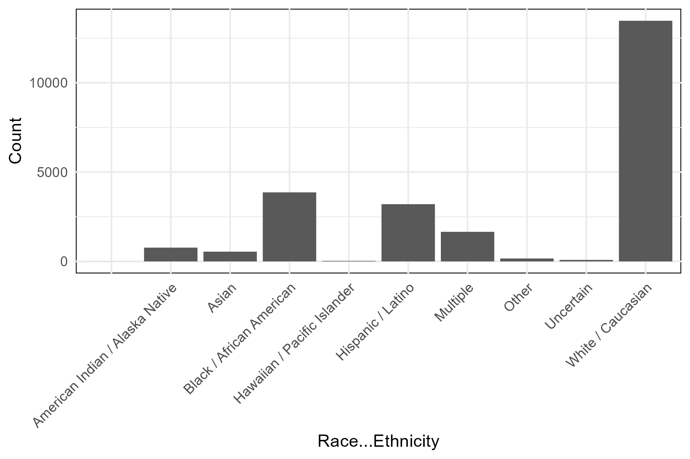
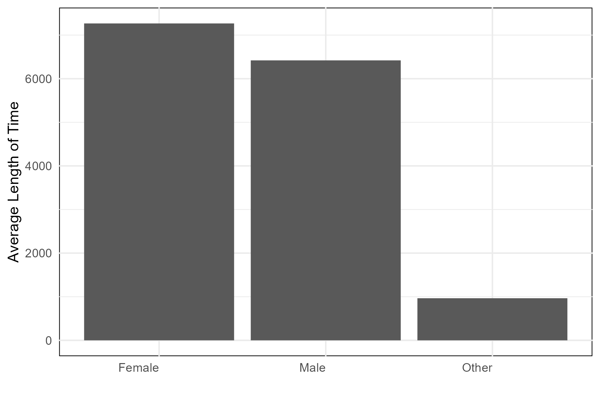
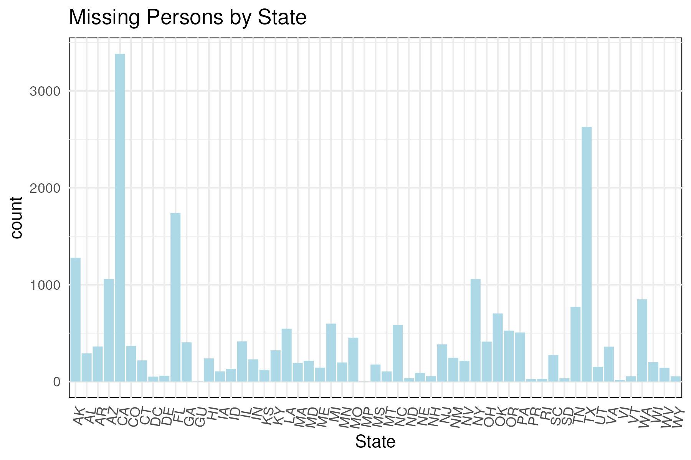
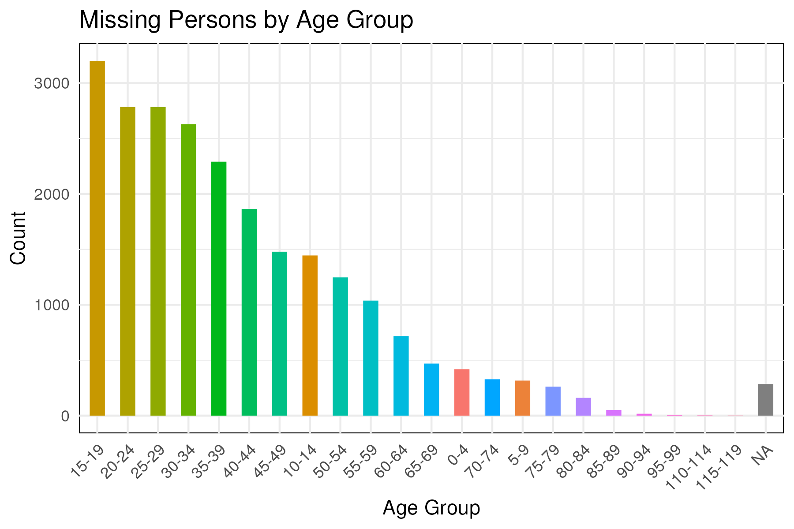
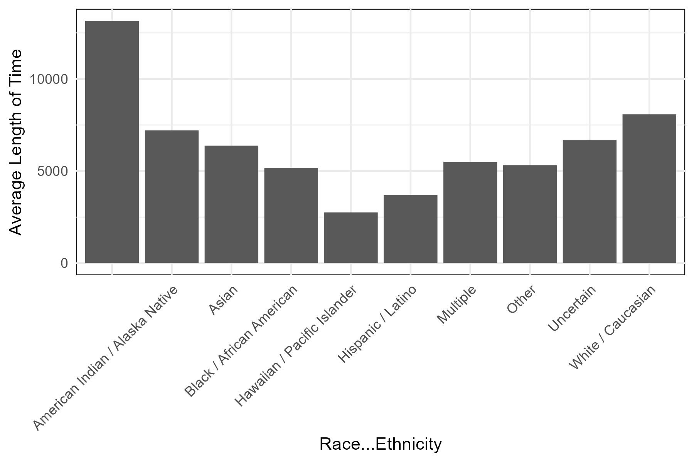

```{r setup, include=FALSE}
knitr::opts_chunk$set(echo = TRUE)
```

# Introduction

In the United States, there are vast racial inequities in outcomes for missing people. Black and Indigenous people, especially women, are  more likely to go missing, but they are less likely to receive media attention, spend more time lost, and tend to have worse outcomes when compared to white people. 
The NamUs (National Missing and Unidentified Persons System) database is a comprehensive, publicly accessible repository that centralizes information on missing persons and unidentified decedents in the United States. It serves as a critical resource for law enforcement, families, and the public, facilitating the collaboration and exchange of information to aid in the resolution of missing persons cases.
This project models the relationship between race/ethnicity and time spent in the database to identify inequities in the length of time individuals remain missing.

# Variables

| Variable Name  | Description                                      |
|-----------------|--------------------------------------------------|
| Case.Number     | Case number assigned to the missing person      |
| DLC             | Date last seen                                   |
| Last.Name       | Last name of the missing person                 |
| First.Name      | First name of the missing person                |
| Missing.Age     | Age at the time of disappearance                |
| City            | City where the person was last seen             |
| County          | County where the person was last seen           |
| State           | State where the person was last seen            |
| Sex             | Gender of the missing person                    |
| Race...Ethnicity| Racial or ethnic background of the missing person|
| Date.Modified   | Date when the information was last modified    |


# Exploratory Analysis

When looking at distribution of entries by race/ethnicity, we see that the vase majority of entries in the database are White / Caucasian. This is roughly proportional the racial distribution of the larger population.

```{r echo=FALSE, fig.cap="Distribution of entries by race/ethnicity", out.width = '70%', fig.align="center"}

```

Additionally, we see slightly more females in the database than males. 

```{r echo=FALSE, fig.cap="Distribution of entries by sex", out.width = '70%', fig.align="center"}

```

We see a that the states with the most entries are California, Texas, and Florida. This is also somewhat proportional to the raw population size of each state. 

```{r echo=FALSE, fig.cap="Distribution of entries by state", out.width = '70%', fig.align="center"}

```

We also see that entries in the database decline as age increases. 

```{r echo=FALSE, fig.cap="Distribution of entries by age", out.width = '70%', fig.align="center"}

```

Finally, we see that there are no significant patterns when we look at the amount of time in the database by race/ethnicity. However, we do see that entries with no race/ethnicity data at all tend to spend a longer amount of time in the database. 

```{r echo=FALSE, fig.cap="Distribution of time in database by race/ethnicity", out.width = '70%', fig.align="center"}

```


\newpage
# Models

I conducted linear regression of Race/Ethnicity with total time in the database. Despite detecting significant differences in multiple racial groups when compared to white people, the  model was a generally poor fit, as indicated by the modest multiple R-squared value of 0.09017, implying that only approximately 9% of the variability in the response variable is explained by the predictor variables. The residual standard error of 5323 suggests a considerable amount of unexplained variability in the model's predictions. While the model may capture some significant relationships, its limited explanatory power and high residual error suggest that it may not be a robust  fit for this data. 

| Term                                        | Estimate | Std.Error | Statistic | P.Value      |
| ------------------------------------------- | -------- | --------- | --------- | ------------ |
| (Intercept)                                 | 8077.    | 45.9      | 176.      | 0            |
| Race...Ethnicity                            | 5075.    | 3764.     | 1.35      | 1.78e-1      |
| Race...EthnicityAmerican Indian / Alaska Native | -866.  | 197.      | -4.39     | 1.11e-5      |
| Race...EthnicityAsian                        | -1701.   | 232.      | -7.32     | 2.58e-13     |
| Race...EthnicityBlack / African American     | -2905.   | 97.1      | -29.9     | 5.29e-193    |
| Race...EthnicityHawaiian / Pacific Islander  | -5321.   | 990.      | -5.38     | 7.64e-8      |
| Race...EthnicityHispanic / Latino            | -4373.   | 105.      | -41.8     | 0            |
| Race...EthnicityMultiple                     | -2578.   | 139.      | -18.6     | 1.02e-76     |
| Race...EthnicityOther                        | -2761.   | 418.      | -6.60     | 4.13e-11     |
| Race...EthnicityUncertain                    | -1402.   | 586.      | -2.39     | 1.68e-2      |

I also conducted linear regression of Sex with total time in the database to a similar outcome. Despite detecting significantly less time spent in the database among males when compared to females, the model was a generally poor fit, as indicated by the modest multiple R-squared value of 0.005638, implying that only a small amount of the variability in the response variable is explained by the predictor variables. The residual standard error similarly suggested a considerable amount of unexplained variability in the model's predictions.While the model may capture a significant relationship, its is probably not a great fit for this data. 


| Term         | Estimate | Std.Error | Statistic | P.Value     |
| ------------ | -------- | --------- | --------- | ----------- |
| (Intercept)  | 7268.    | 58.8      | 124.      | 0           |
| SexMale      | -847.    | 74.4      | -11.4     | 6.31e-30    |
| SexOther     | -6302.   | 2489.     | -2.53     | 1.14e-2     |


# Discussion

While this database is a wealth of information for law enforcement and the families of missing persons and decedents, it is not particularly useful for drawing meaningful statistical inferences. This is because states are not required to use the database and there are no outcomes, meaning that when a person is found, they are removed from the database. In fact, one cannot even FOIA for this information. Therefore, it makes investigations into inequities of outcomes very difficult, if not impossible. This database is not meant for research purposes and drawing conclusions about anything is very difficult. 

# Future Questions

Additional data will be required to examine inequities in the amount of time that missing persons remain missing. At minimum, a dataset with the outcomes for missing persons and decedents and a well characterized sample strategy (i.e., who is required to report to the database) will be required to make draw important conclusions. 


